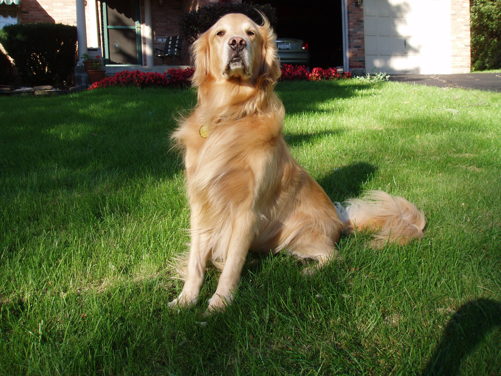

# Use a Pre-trained Image Classifier to Identify Dog Breeds

> This project was a milestone in my journey to study the AI Programming with Python Nanodegree provided by Udacity.

## Project Goal
In this project, I tested my Python skills by working with three different pre-trained image classifiers. I wrote my own script to identify different dog breeds.

## Project Description:
Your city is hosting a citywide dog show and you have volunteered to help the organizing committee with contestant registration. 

Every participant that registers must submit an image of their dog along with biographical information about their dog. The registration system tags the images based upon the biographical information.

Some people are planning on registering pets that aren’t actual dogs.

You need to use an already developed Python classifier to make sure the participants are dogs.

Note, you DO NOT need to create the classifier. It will be provided to you. You will need to apply the Python tools you just learned to USE the classifier.

## Tasks:
Using your Python skills, you will determine which image classification algorithm works the "best" on classifying images as "dogs" or "not dogs".

Determine how well the "best" classification algorithm works on correctly identifying a dog's breed.

If you are confused by the term image classifier look at it simply as a tool that has an input and an output. The Input is an image. The output determines what the image depicts. (for example: a dog). 

Be mindful of the fact that image classifiers do not always categorize the images correctly. (We will get to all those details much later on the program).

Time how long each algorithm takes to solve the classification problem. With computational tasks, there is often a trade-off between accuracy and runtime. 

The more accurate an algorithm, the higher the likelihood that it will take more time to run and use more computational resources to run.

## Important Notes:
For this image classification task you will be using an image classification application using a deep learning model called a convolutional neural network (often abbreviated as CNN). 

CNNs work particularly well for detecting features in images like colors, textures, and edges; then using these features to identify objects in the images. 

You'll use a CNN that has already learned the features from a giant dataset of 1.2 million images called ImageNet. There are different types of CNNs that have different structures (architectures) that work better or worse depending on your criteria. 

With this project you'll explore the three different architectures (AlexNet, VGG, and ResNet) and determine which is best for your application.

We have provided you with a classifier function in classifier.py that will allow you to use these CNNs to classify your images. 

The test_classifier.py file contains an example program that demonstrates how to use the classifier function. For this project, you will be focusing on using your Python skills to complete these tasks using the classifier function; in the Neural Networks lesson you will be learning more about how these algorithms work.

Remember that certain breeds of dog look very similar. The more images of two similar looking dog breeds that the algorithm has learned from, the more likely the algorithm will be able to distinguish between those two breeds. 

We have found the following breeds to look very similar: Great Pyrenees and Kuvasz, German Shepherd and Malinois, Beagle and Walker Hound, amongst others.

## About The Author

* Author: Mohamed Abdel-Gawad Ibrahim
* Contact: muhammadabdelgawwad@gmail.com
* Phone: +201069052620 || +201147821232
